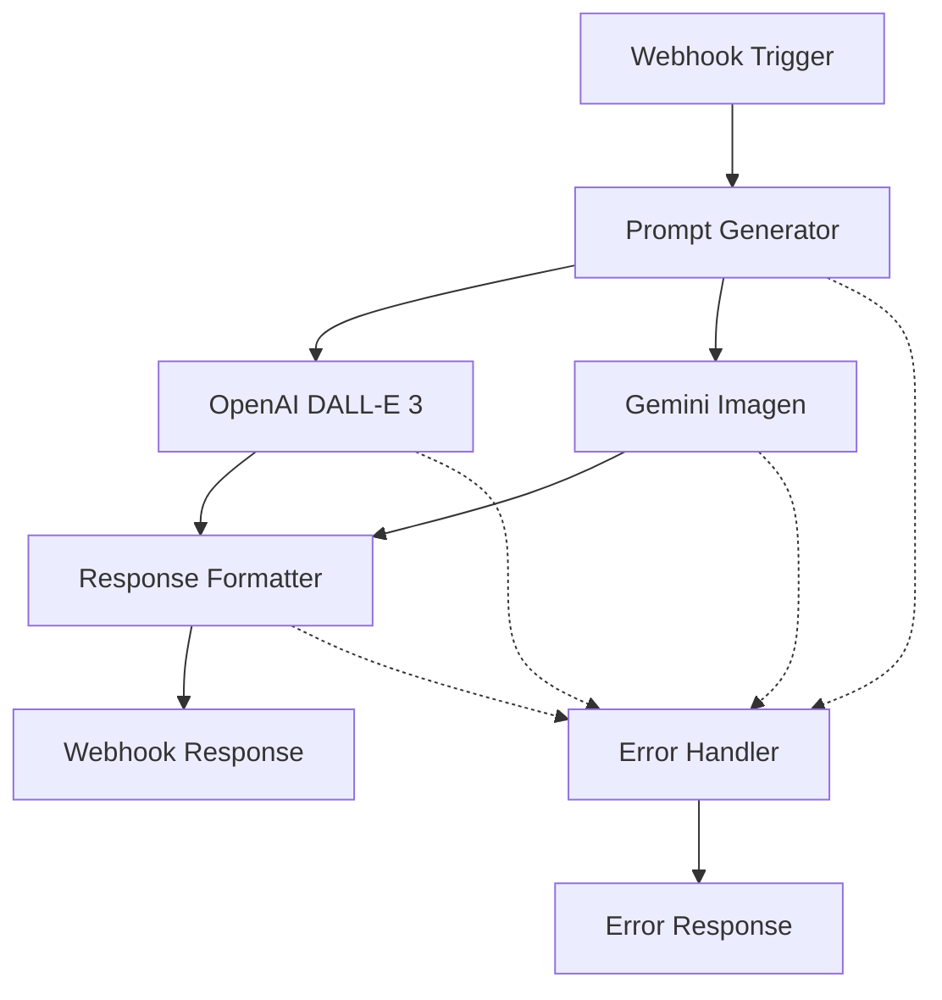

# 🤖 n8n Workflow Kurulum Rehberi | n8n Setup Guide

## 📋 Genel Bakış | Overview

Bu rehber, Rüya Dünyası Oluşturucu uygulaması için n8n platformunda workflow nasıl kurulacağını detaylı olarak açıklar.

## 🚀 Hızlı Kurulum | Quick Setup

### 1️⃣ n8n Workflow Import

1. n8n arayüzünde **"Import from file"** seçeneğini tıklayın
2. `n8n-workflow.json` dosyasını seçin ve yükleyin
3. Workflow otomatik olarak yüklenir

### 2️⃣ API Credentials Kurulumu

#### OpenAI API Kurulumu:
1. n8n'de **Credentials** bölümüne gidin
2. **"Create New Credential"** → **"OpenAI"** seçin
3. OpenAI API Key'inizi girin
4. Test edin ve kaydedin

#### Google Gemini API Kurulumu:
1. **"Create New Credential"** → **"HTTP Header Auth"** seçin
2. Name: `geminiApi`
3. Header Name: `Authorization`
4. Header Value: `Bearer YOUR_GEMINI_API_KEY`

### 3️⃣ Webhook URL Alma

1. **"Webhook Trigger"** node'una tıklayın
2. **"Test URL"** veya **"Production URL"** kopyalayın
3. URL şu formatta olacak: `https://your-n8n.com/webhook/dream-generator`

### 4️⃣ Frontend Entegrasyonu

`script.js` dosyasında:
```javascript
const N8N_WEBHOOK_URL = 'https://your-n8n.com/webhook/dream-generator';
```

## 🔧 Detaylı Node Yapılandırması

### 📥 1. Webhook Trigger Node

**Amaç**: HTML formundan gelen verileri almak

#### Ayarlar:
- **HTTP Method**: POST
- **Path**: `dream-generator`
- **Response Mode**: "Respond to Webhook"

#### Test:
```bash
curl -X POST https://your-n8n.com/webhook/dream-generator \
  -H "Content-Type: application/json" \
  -d '{
    "ad": "Test User",
    "renkler": "mavi, yeşil",
    "mekanlar": "orman, göl",
    "atmosfer": "huzurlu",
    "karakterler": "unicorn",
    "detaylar": "yıldızlar"
  }'
```

### 🧠 2. Prompt Generator Function Node

**Amaç**: Türkçe form verilerini İngilizce AI prompt'una çevirmek

#### Özellikler:
- ✅ Türkçe-İngilizce çeviri
- ✅ AI için optimize edilmiş prompt yapısı
- ✅ Metadata oluşturma
- ✅ Hata kontrolü

#### Çıktı Örneği:
```json
{
  "gorselPrompt": "A highly detailed, surreal dreamscape inspired by forest, lake, featuring unicorn, in a peaceful mood, with dominant colors blue, green, including special details like stars, cinematic lighting, photorealistic, 8K resolution, fantasy art style, professional digital art, magical atmosphere",
  "user_name": "Test User",
  "metadata": {...}
}
```

### 🎨 3A. OpenAI DALL-E 3 Node

**Amaç**: OpenAI DALL-E 3 ile görsel oluşturma

#### HTTP Request Ayarları:
- **Method**: POST
- **URL**: `https://api.openai.com/v1/images/generations`
- **Authentication**: OpenAI API Credential
- **Timeout**: 60000ms (60 saniye)

#### Request Body:
```json
{
  "model": "dall-e-3",
  "prompt": "{{ $json.gorselPrompt }}",
  "n": 1,
  "size": "1024x1024",
  "quality": "standard",
  "response_format": "url"
}
```

### 🎨 3B. Google Gemini Imagen Node

**Amaç**: Google Gemini Imagen ile görsel oluşturma

#### HTTP Request Ayarları:
- **Method**: POST
- **URL**: `https://generativelanguage.googleapis.com/v1beta/models/imagen-3.0-generate-001:generateImage`
- **Query Parameters**: `key={{ $credentials.geminiApi.apiKey }}`

#### Request Body:
```json
{
  "prompt": "{{ $('Prompt Generator').item.json.gorselPrompt }}",
  "sampleCount": 1,
  "aspectRatio": "1:1",
  "safetySettings": [
    {
      "category": "HARM_CATEGORY_HATE_SPEECH",
      "threshold": "BLOCK_MEDIUM_AND_ABOVE"
    }
  ]
}
```

### 📝 4. Response Formatter Function Node

**Amaç**: AI servis yanıtlarını standardize etmek

#### İşlevler:
- ✅ OpenAI ve Gemini response formatlarını destekler
- ✅ URL doğrulama
- ✅ Metadata ekleme
- ✅ Hata yönetimi

#### Çıktı:
```json
{
  "success": true,
  "image_url": "https://...",
  "user_name": "Test User",
  "ai_service": "OpenAI DALL-E 3",
  "generated_at": "2024-01-01T12:00:00Z",
  "original_form_data": {...}
}
```

### 📤 5. Webhook Response Node

**Amaç**: HTML sayfasına sonucu göndermek

#### Headers:
```json
{
  "Content-Type": "application/json",
  "Access-Control-Allow-Origin": "*",
  "Access-Control-Allow-Methods": "POST, OPTIONS",
  "Access-Control-Allow-Headers": "Content-Type"
}
```

### ⚠️ 6. Error Handler Function Node

**Amaç**: Hataları yakalamak ve kullanıcı dostu mesajlar oluşturmak

#### Hata Tipleri:
- **TIMEOUT_ERROR**: Bağlantı zaman aşımı
- **RATE_LIMIT_ERROR**: Çok fazla istek
- **API_ERROR**: API anahtarı sorunu
- **CONTENT_ERROR**: İçerik uygun değil

## 🔄 Workflow Akışı



## 🧪 Test Senaryoları

### 1. Basit Test
```json
{
  "ad": "Test",
  "renkler": "mavi",
  "mekanlar": "orman",
  "atmosfer": "huzurlu",
  "karakterler": "unicorn",
  "detaylar": "yıldızlar"
}
```

### 2. Karmaşık Test
```json
{
  "ad": "Özge",
  "renkler": "eflatun, gümüş, gece mavisi",
  "mekanlar": "kristal mağara, uçan adalar, bulut şehri",
  "atmosfer": "gizemli, büyüleyici, huzur verici",
  "karakterler": "ejder, ışık saçan kelebekler, kristal unicorn",
  "detaylar": "parlayan kristaller, dans eden yıldızlar, büyülü ağaçlar"
}
```

### 3. Hata Test Senaryoları
```json
// Eksik veri testi
{
  "ad": "Test",
  "renkler": ""
}

// Boş form testi
{}

// Çok uzun metin testi
{
  "ad": "Test" + "x".repeat(1000),
  ...
}
```

## 🔐 Güvenlik Ayarları

### Rate Limiting
n8n'de execution settings:
```json
{
  "maxExecutions": 100,
  "timeWindow": "1h"
}
```

### Webhook Security
```javascript
// Function Node'da IP kontrolü
const clientIP = $('Webhook Trigger').item.headers['x-forwarded-for'] || 
                 $('Webhook Trigger').item.headers['x-real-ip'];

if (BLOCKED_IPS.includes(clientIP)) {
  throw new Error('Access denied');
}
```

### Input Validation
```javascript
// Prompt Generator'da validation
function validateInput(data) {
  const maxLength = 200;
  const forbiddenWords = ['spam', 'abuse'];
  
  for (const [key, value] of Object.entries(data)) {
    if (typeof value !== 'string' || value.length > maxLength) {
      throw new Error(`Invalid ${key}`);
    }
    
    if (forbiddenWords.some(word => value.toLowerCase().includes(word))) {
      throw new Error(`Forbidden content in ${key}`);
    }
  }
}
```

## 📊 Monitoring ve Logging

### Custom Logging Function
```javascript
// Her node'a eklenebilir
function logEvent(eventType, data) {
  const logEntry = {
    timestamp: new Date().toISOString(),
    event: eventType,
    user: data.user_name || 'unknown',
    workflow: 'dream-generator',
    data: data
  };
  
  console.log(JSON.stringify(logEntry));
  
  // External logging service'e gönder (opsiyonel)
  // await fetch('https://your-logging-service.com/log', {...});
}
```

### Kullanım İstatistikleri
```javascript
// Response Formatter'da
const stats = {
  total_requests: (await getGlobalValue('total_requests') || 0) + 1,
  successful_generations: stats.total_requests,
  ai_service_used: aiService,
  user_country: getCountryFromIP(clientIP)
};

await setGlobalValue('total_requests', stats.total_requests);
```

## 🚀 Production Deployment

### 1. Environment Variables
```bash
# n8n instance
N8N_BASIC_AUTH_ACTIVE=true
N8N_BASIC_AUTH_USER=admin
N8N_BASIC_AUTH_PASSWORD=secure_password

# Database
DB_TYPE=postgresdb
DB_POSTGRESDB_HOST=localhost
DB_POSTGRESDB_DATABASE=n8n
```

### 2. SSL Configuration
```nginx
server {
    listen 443 ssl;
    server_name your-n8n-domain.com;
    
    ssl_certificate /path/to/cert.pem;
    ssl_certificate_key /path/to/key.pem;
    
    location / {
        proxy_pass http://localhost:5678;
        proxy_set_header Host $host;
        proxy_set_header X-Real-IP $remote_addr;
    }
}
```

### 3. Docker Deployment
```yaml
version: '3.8'
services:
  n8n:
    image: n8nio/n8n
    ports:
      - "5678:5678"
    environment:
      - N8N_BASIC_AUTH_ACTIVE=true
      - N8N_BASIC_AUTH_USER=admin
      - N8N_BASIC_AUTH_PASSWORD=secure_password
      - WEBHOOK_URL=https://your-domain.com
    volumes:
      - n8n_data:/home/node/.n8n
    restart: unless-stopped

volumes:
  n8n_data:
```

## 🔄 Maintenance

### Regular Tasks
- [ ] API key rotation (monthly)
- [ ] Log cleanup (weekly)
- [ ] Performance monitoring (daily)
- [ ] Backup workflow config (weekly)

### Update Process
1. Export current workflow
2. Test new version in staging
3. Import to production
4. Monitor for issues
5. Rollback if needed

## 📚 Troubleshooting

### Common Issues

#### 1. Webhook not receiving data
```javascript
// Debug Webhook
console.log('Webhook headers:', JSON.stringify($('Webhook Trigger').item.headers));
console.log('Webhook body:', JSON.stringify($('Webhook Trigger').item.json));
```

#### 2. AI API errors
```javascript
// Debug AI Response
console.log('AI Request:', JSON.stringify(requestBody));
console.log('AI Response:', JSON.stringify(aiResponse));
console.log('Status Code:', $('OpenAI DALL-E 3').item.statusCode);
```

#### 3. CORS issues
```javascript
// Test CORS headers
const corsHeaders = {
  'Access-Control-Allow-Origin': '*',
  'Access-Control-Allow-Methods': 'POST, OPTIONS, GET',
  'Access-Control-Allow-Headers': 'Content-Type, Authorization'
};
```

## 🎯 Performance Optimization

### Caching Strategy
```javascript
// Cache frequent translations
const translationCache = await getGlobalValue('translation_cache') || {};

if (translationCache[inputText]) {
  return translationCache[inputText];
}

const translated = translateText(inputText);
translationCache[inputText] = translated;
await setGlobalValue('translation_cache', translationCache);
```

### Parallel Processing
```javascript
// Multiple AI services simultaneously
const aiPromises = [];

if (USE_OPENAI) {
  aiPromises.push(callOpenAI(prompt));
}

if (USE_GEMINI) {
  aiPromises.push(callGemini(prompt));
}

const results = await Promise.allSettled(aiPromises);
```

---

## 📞 Support

- 📧 Email: support@example.com
- 💬 Discord: [n8n Community](https://discord.gg/n8n)
- 📚 Docs: [n8n Documentation](https://docs.n8n.io)
- 🐛 Issues: [GitHub Issues](https://github.com/n8n-io/n8n)

---

**n8n ile rüya dünyanızı oluşturun! 🚀✨**